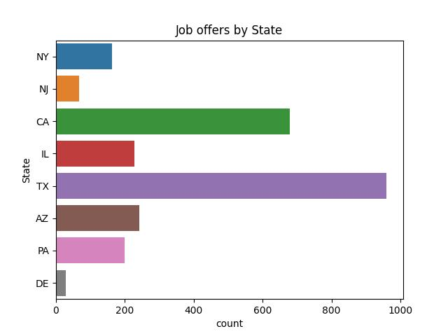
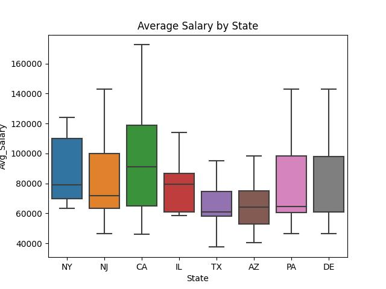
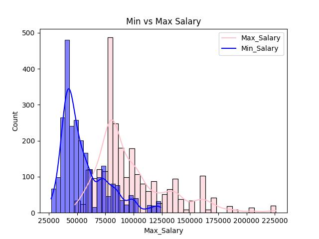

# The Job Market

## Table of Contents 

- [Project Overview](#project-overview)
- [Data Sources ](#data-sources)
- [Tools](#tools)
- [Methodology](#methodology)
- [Exploratory Data Analysis](#exploratory-data-analysis)
- [Data Analysis](#data-analysis) 
- [Results Findings](#results-findings)
- [Recommendations](#recommendations)
- [Next Action](#next-action)
- [Tableau](#tableau)

## Project Overview 

This project seeks to provide valuable insights into the job market for analyst roles, including data analysts, business analysts, and similar positions, by developing a comprehensive ETL (Extract, Transform, Load), EDA (Exploratory Data Analysis), and CDA (Confirmatory Data Analysis) pipeline. The research aims to help current data analysts assess salary outcomes, understand the impact of company ratings on salaries, and analyze the distribution of jobs and salaries across different sectors and states.

The findings will not only support existing data analysts in making informed career decisions but will also serve as a resource for The Knowledge House and future data analyst fellows as they navigate their search for data-related roles.

## Data Sources 

Data: The primary dataset used for this analysis is in the data folder. The data was collected from Kaggle.

## Tools 

- PostgreSQL - relational database management system (RDBMS) used to manage structured data. 
- SQLAlchemy - For querying and extracting data from the database. 
- Sklearn - For implementing machine learning algorithms and models.
  - sklearn.linear_model
  - sklearn.metrics
  - sklearn.tree
- Tableau - For data visualization and dashboard. 
- Python Libraries: For data manipulation, analysis, and visualization.
  - pandas
  - matplotlib
  - NumPy
  - seaborn

## Methodology 
  In the data analysis phase, the following tasks were performed:
  
  1. Data loading and inspection.
     
  2. Cleaned the CSV file using Python functions and libraries. This involved dropping all null values, changing data types where necessary, and ensuring consistency throughout the dataset. The cleaned data was saved as clean_data.csv in the data folder for further processing.
     
  3. After cleaning the data, we created a schema and wrote a function to open this schema in an AWS database. This allowed us to efficiently store and manage the cleaned data for subsequent analysis.
     
  4. Using SQLAlchemy, we extracted the data from the AWS database. Then conducted Exploratory Data Analysis (EDA) to identify key patterns, trends, and relationships within the data. For Confirmatory Data Analysis (CDA), we implemented predictive modeling using linear regression, lasso regression, and decision tree algorithms to validate and predict outcomes based on the data.
     
  5. Based on the insights gained from EDA and CDA, we created a Tableau dashboard. The visualization highlights key insights and trends in the data, making it easier to interpret and communicate the results.

## Exploratory Data Analysis

EDA involved exploring the data to answer key questions such as: 

- What are the different salaries for analysts across various states?

- Which sectors offer the most analyst roles, and what are the associated salaries?

- Which companies are offering the most analyst jobs?

- Which state provides the most opportunities for analyst roles?

- Does the rating of a company have an impact on the salaries offered?

##  Data Analysis 

 

This visualization illustrates the number of analyst jobs offered by different states. Surprisingly, Texas emerges as the state with the highest number of data and business analyst job opportunities, surpassing traditionally dominant states like California and New York. This trend may indicate that many companies are increasingly establishing operations in southern states like Texas and Arizona. Consequently, candidates seeking these roles should be prepared to consider relocation to these emerging job markets.

This box plot demonstrates the average salaries for analyst roles across different states. The observation reveals that despite Texas and Arizona offering the most job opportunities, states like California, New York, and Illinois continue to offer higher average salaries. This suggests that while job availability is increasing in southern states, traditional hubs still provide more competitive compensation.

This bar graph displays the average salaries by sector, revealing that industries such as media, retail, manufacturing, IT, and healthcare offer competitive salaries for analyst roles. It's interesting to note that sectors like retail, which some may not typically associate with data or business analysis, also provide strong salary opportunities. This insight highlights the broader demand for analysts across various industries, suggesting that candidates should consider a wider range of sectors beyond just tech when exploring career opportunities. 

This histogram displays the distribution of minimum and maximum salaries for analyst roles. The mode of the minimum salary is around $52K, with the mean slightly higher, suggesting room for salary negotiation. The mode of the maximum salary is around $85K, with the mean close to $100K. Both distributions are right-skewed and not normally distributed, indicating that by removing outliers, we might achieve a more normal distribution.

## Results Findings
The analysis results are summarized as follows:

1. Texas leads in analyst job openings, surpassing traditional hubs like California and New York, indicating a shift towards southern states. Candidates might need to consider relocating to these emerging markets.
   
2. While Texas and Arizona offer the most job opportunities, California, New York, and Illinois still provide higher average salaries, reflecting more competitive compensation in traditional markets.
   
3. Sectors such as media, retail, manufacturing, IT, and healthcare offer competitive salaries for analysts, with retail being an unexpectedly lucrative industry, indicating broad demand across various fields.
   
4. Company rating does not affect the salary offered.

## Recommendations
Based on the analysis, the following is recommended:

- Candidates should consider relocating, given the increase in analyst job opportunities in states like Texas and Arizona.
  
- Analysts should broaden their job search beyond tech to include sectors like retail, media, manufacturing, and healthcare, which offer competitive salaries and a range of opportunities.
  
- Analysts should target traditional hubs like California and New York for higher salaries.

## Next Action 
1. Improve data accuracy by addressing inconsistencies and removing outliers to ensure more reliable insights.

2. Incorporate additional factors such as company size, job roles, and required skills to provide a more comprehensive job market overview.

3. Analyze job markets at a more granular level, such as metropolitan areas, to identify specific high-demand locations.

4. Examine trends over time to understand how job opportunities and salaries are evolving and anticipate future changes.

5. Collect qualitative data through surveys or interviews with industry professionals to gain insights into job market dynamics and employer expectations.

## Tableau 

Tableau [Download here](https://public.tableau.com/app/profile/ari.de.la.mar/viz/ECONPROJECT_16867776094300/Dashboard5?publish=yes)
